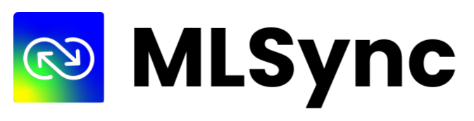

<div align="center">



**Sync your ML data seamlessly with productivity tools you love**

______________________________________________________________________

<p align="center">
  <a href="https://www.mlsync.dev/">Website</a> •
  <a href="#installation">Installation</a> •
  <a href="https://mlsync.readthedocs.io/en/latest/">Docs</a> •
  <a href="#example">Examples</a> •
  <a href="#contributing">Contributing</a>
</p>

[](https://badge.fury.io/py/mlsync)
[](https://pepy.tech/project/mlsync)
[](https://mlsync.readthedocs.io/en/latest/)
[](https://join.slack.com/t/mlsync/shared_invite/zt-1ap8axys5-awwIfDGR8OWP1oFRKZp6OQ)
[](https://github.com/paletteml/mlsync/blob/master/LICENSE)

</div>

## Overview

### What is MLSync?

MLSync is a Python library that acts as a bridge between your ML workflow and your project planning and management tools.

### Why MLSync?

Developing ML projects is a lot of fun, but they are also hard to plan and manage.
While the ML community has built several tools for developers to better track and visualize their ML workflow data,
there is a disconnect between ML workflow data and the tools that are used for project management.
MLSync is designed to bridge this gap.


### How Does it Work?

There are four main aspects of MLSync:

1. MLSync interfaces with modern ML experiment tracking tools such as [MLflow](https://www.mlflow.org/) and imports the raw data.
2. Raw data from ML experiment tracking tools are converted to MLSync internal data format (user-defined) and stored in a database.
3. MLSync engine processes this raw data and generates consolidated insights for your project.
4. The insights are then converted to suitable formats and sent to your project planning and management tools such as [Notion](https://notion.so/).

<div align="center">

</div>

We are actively building MLSync with the vision to become a one-stop standard interface to map data from ML experiments to project management tools.
The above figure shows the  high-level architecture of MLSync.
All the functionality is not yet available; please refer to the [Roadmap](#roadmap) for the current status.
If you would like to contribute to MLSync, please refer to the [Contributing](#contributing) section.

## Installation

```sh
pip install mlsync
```

## Example

In this example, we will sync your machine learning experiments to Notion in three simple steps!

### 1. Checkout the MLSync GitHub Repository

1. `git clone https://github.com/paletteml/mlsync.git`
2. `cd mlsync/examples/mlflow-notion/` : Change directory to the example directory
3. `mv .env.example .env`: This file is intended to store your personal API keys.

Note that the directory contains YAML files for configurations (`config.yaml`) and report formatting (`format.yaml`). We will leave the configurations as is for now.

### 2. ML Training Environment

Now let us set up our ML Training environment. For this example, we will rely on the [MLFlow](https://mlflow.org/) framework and Pytorch as our ML framework. Since MLFlow supports all major ML frameworks, this example can be easily adapted to other frameworks.

1. `pip install -r requirements.txt` : Install the requirements for this example.
    - Note that the above step installs Pytorch. If you run into issues, please refer to the [Pytorch](https://pytorch.org/) documentation for more information.
2. Run example training using `python mlflow_pytorch.py --run-name <name>`.

### 3. Notion Setup

Let us now link Notion to MLSync. This is required only for the first time you run MLSync.

1. Create a **new integration** to Notion.
    1. Visit [notion.so/my-integrations](https://www.notion.so/my-integrations)
    2. Click the `+ New Integration` button
    3. Name it as `MLSync` and hit submit.
    4. Copy your "Internal Integration Token" from your Notion integration page.
    5. Open the `.env` file in your path and update the Notion token.
        - `NOTION_TOKEN=secret_0000000000000000000000000000000000000000000`
2. Create a **new page** in Notion. This will serve as the root page for your MLFlow runs.
    1. Let us name the page as `Demo`.
    2. Click the Share button on the top right corner of the page.
    3. Click the Invite button and then choose `MLSync` integration.

### All Done

You are now all set! Now let us sync your MLFlow runs to Notion.

```sh
mlsync --config config.yaml
```

First time you run, you will be prompted to choose a page to sync to.
From the options, choose the page you created in the previous step (`Demo`).

That's it! You can now view your MLFlow runs in Notion. As long as mlsync is running, all your future experiments and runs in this directory should appear in the selected Notion page.

### Troubleshooting

1. If you are getting an error related to the `NOTION_TOKEN` not being found, you can pass the `--notion-token` flag to `mlsync` to specify the token.
2. If you are having trouble with MNIST dataflow download, you can try to download the data manually from [here](www.di.ens.fr/~lelarge/MNIST.tar.gz).
3. Please [contact us](mailto:support@paletteml.com) for any other issues.

Please raise an issue, or reach out if you have any other errors.

### Advanced

1. You can override the Notion page id, token, and other configurations by either modifying the `config.yaml` file or by passing the arguments to the `mlsync` command. Run `mlsync --help` to see the available arguments.
2. *Custom Report Formats*: `mlsync` allows you to customize the report much further. You can customize the report by adding your own `format.yaml` file. Read documentation [here](https://mlsync.readthedocs.io/en/latest/topical_guides/reports.html) to learn more.
3. *Custom Refresh Rates*: You can control the refresh rate of the report by setting the `refresh_rate` field in the configuration file.
4. *Restarting mlsync*: You can restart mlsync any time without losing earlier runs.

Enjoy! If you have any further questions, please [contact us](mailto:support@paletteml.com).

## Roadmap

We want to support different training environments and different productivity tools.

1. Productivity Tools
    1. [Notion](https://notion.so): **Supported**
    2. [Trello](https://trello.com): Planned
    3. [Confluence](https://www.atlassian.com/software/confluence): **In progress**
    4. [Jira](https://www.atlassian.com/software/jira): Planned
2. Monitoring Frameworks
    1. [MLFlow](https://www.mlflow.org): **Supported**
    2. [TensorBoard](https://www.tensorflow.org/get_started/summaries_and_tensorboard): **In progress**
    3. [ClearML](https://www.clearml.com): Planned
3. Programmatic API
    1. Planned

Do you have other tools/frameworks you would like to see supported? Let us know!

## Contributing

We welcome contributions from the community. Please feel free to open an issue or pull request. Or, if you are interested in working closely with us, please [contact us](mailto:support@paletteml.com) directly. We will be happy to talk to you!
